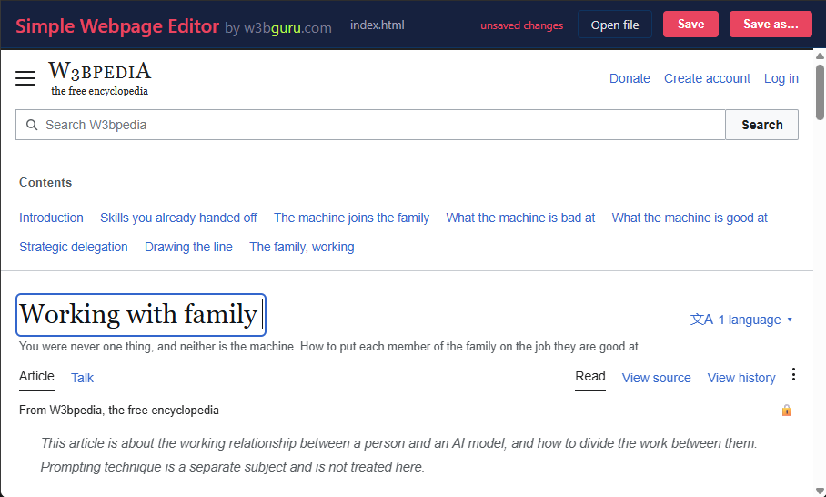

# Simple Webpage Editor

A single-file, browser-based HTML editor. Open any `.html` file, edit text inline, and save the result. No server, no build step, no dependencies.

LISTEN TO: [PGNIP.ca](https://pgnip.ca) — a hilarious Canadian comedy podcast.

## How to use

1. Open `editor.html` in your browser (double-click it)
2. Click **Choose file** and pick any HTML page
3. Click any text to edit it
4. Click **Save** to download the updated file with the same name, or **Save as...** to pick a new name

## How it works

Uses JavaScript to load your HTML file into an iframe, then sets `contenteditable="true"` on every text element so you edit the rendered page directly. On save, it strips the editor attributes, serializes the DOM back to clean HTML, and triggers a file download.

## What it does

- Walks the page DOM and makes every text element editable
- Skips SVGs, scripts, styles, and structural containers
- Disables links while editing so you don't navigate away
- Syncs table-of-contents links when you edit headings
- Warns you before closing with unsaved changes
- Produces a clean HTML file with no editor artifacts

## What it doesn't do

- Add or remove elements (paragraphs, sections, images)
- Edit CSS or page structure
- Run a server or require any installation

## License

[MIT](LICENSE)
